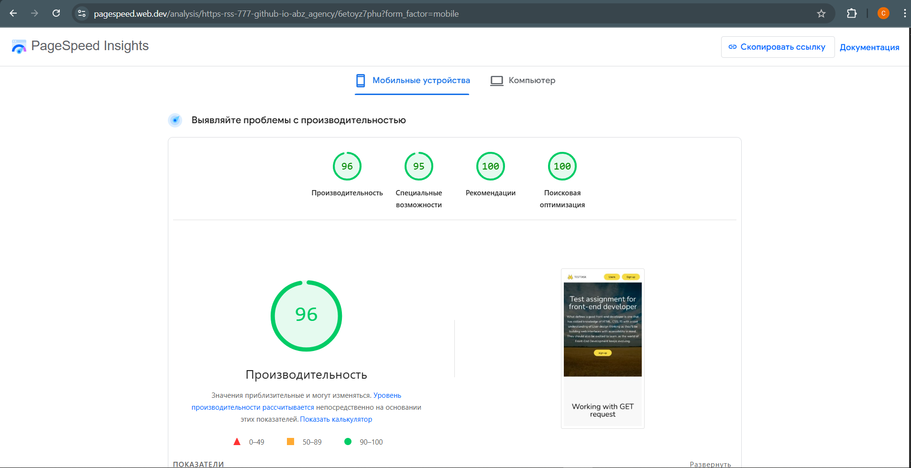
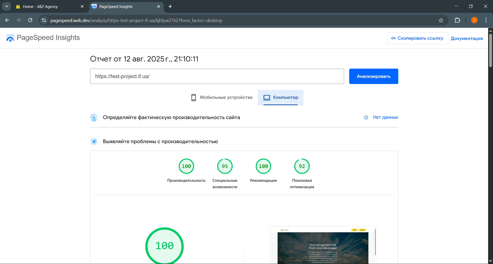
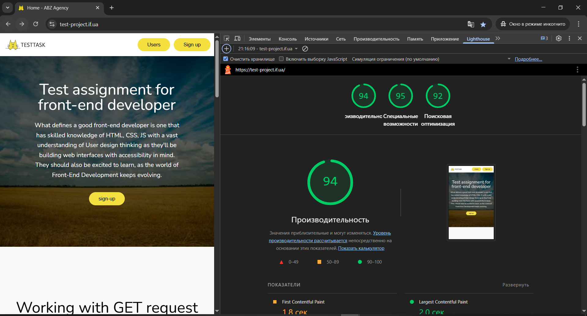
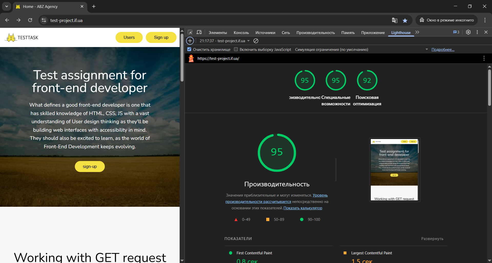

# ABZ Agency - Frontend Test Project  
> This project is a frontend test task implementation using React and modern development tools.

---

[Link to the live site (*abz_agency*)](https://rss-777.github.io/abz_agency)

---

## Description  
The project implements a single-page interface based on the provided Figma design.  
Key features include:

* Displaying a list of users fetched via REST API (GET request) with pagination and sorting by registration date (newest first).  
* A "Show more" button that loads additional pages of users and hides when no more users are available.  
* A user registration form with frontend validation and data submission through REST API (POST request).  
* After successful registration, the user list updates and resets to the first page.

### Tech Stack  
* [X] **React 18**: JavaScript library for building user interfaces.  
* [X] **Vite**: Fast and modern build tool for frontend development.  
* [X] **React Router DOM**: Library for declarative routing and navigation in React applications.  
* [X] **Redux Toolkit**: Official, opinionated toolset for efficient Redux development.  
* [X] **React Hook Form**: Performant, flexible library for handling forms in React.  
* [X] **Sass**: CSS preprocessor that adds power and elegance to the basic language.
* [X] **React Helmet Async**: – Manage document head for improved SEO and metadata handling.
* [X] **gh-pages**: gh-pages – Easy deployment of the application to GitHub Pages.

___
### Screenshot

    

        
        
    

    

        
        
    

    

        
    

