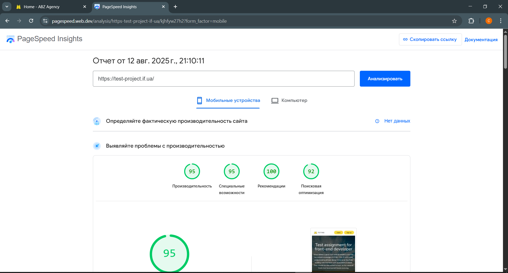
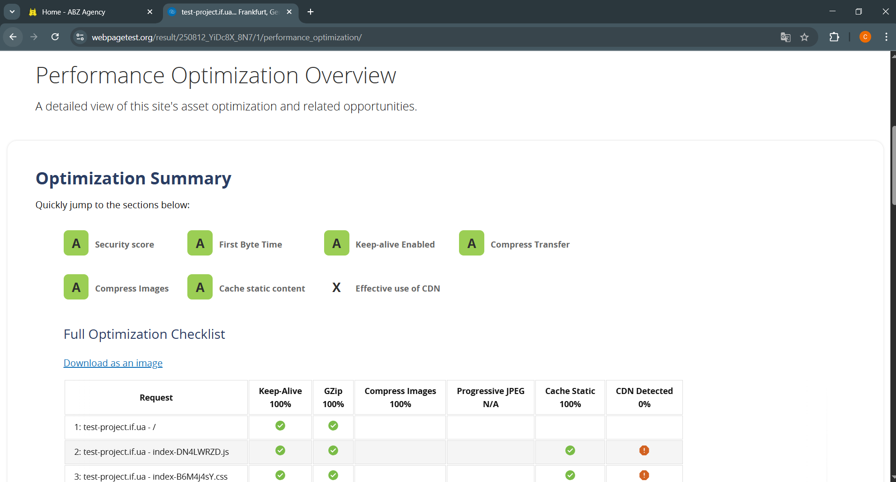

# ABZ Agency - Frontend Test Project  
> This project is a frontend test task implementation using React and modern development tools.

---

[Link to the live site (*abz_agency*)](https://test-project.if.ua/)

---

## Description  
The project implements a single-page interface based on the provided Figma design.  
Key features include:

* Displaying a list of users fetched via REST API (GET request) with pagination and sorting by registration date (newest first).  
* A "Show more" button that loads additional pages of users and hides when no more users are available.  
* A user registration form with frontend validation and data submission through REST API (POST request).  
* After successful registration, the user list updates and resets to the first page.

## Deployment & Infrastructure
* The project was successfully deployed on a production server, ensuring stable and performant hosting.
* A custom domain was connected for a professional and user-friendly URL experience: https://test-project.if.ua/.
* An SSL certificate was obtained and configured, enabling HTTPS for secure data transfer and improved SEO rankings.
* All static assets and images were optimized for fast loading times, reducing bandwidth usage and improving user experience.
* Project files and build artifacts are properly organized and maintained on the server.

## Testing & Documentation
* All tests specified in the project documentation have passed successfully, ensuring compliance with the defined requirements and quality standards.
* Code and project structure strictly adhere to the provided documentation and best practices, facilitating maintainability and scalability.

## SEO & Performance Enhancements
* Added React Helmet Async to manage document head tags dynamically, enhancing SEO by setting appropriate metadata, titles, and descriptions.
* Image assets were optimized and compressed without losing quality to improve page load speeds and performance metrics.

### Tech Stack  
* [X] **React 18**: JavaScript library for building user interfaces.  
* [X] **Vite**: Fast and modern build tool for frontend development.  
* [X] **React Router DOM**: Library for declarative routing and navigation in React applications.  
* [X] **Redux Toolkit**: Official, opinionated toolset for efficient Redux development.  
* [X] **React Hook Form**: Performant, flexible library for handling forms in React.  
* [X] **Sass**: CSS preprocessor that adds power and elegance to the basic language.
* [X] **React Helmet Async**: – Manage document head for improved SEO and metadata handling.

### Screenshot

    

        
        
    

    

        
        
    

    

        
    

